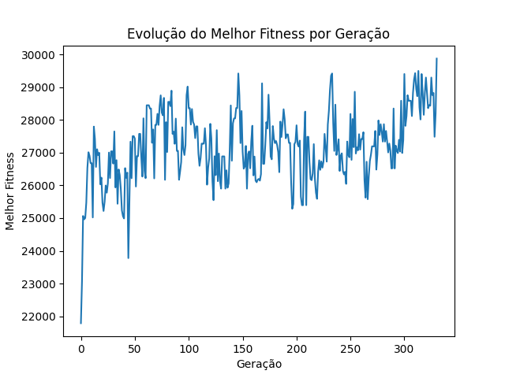

Algoritmo Genético para o Problema da Mochila
Este projeto implementa um Algoritmo Genético para resolver o Problema da Mochila, um clássico problema de otimização combinatória. O objetivo é selecionar um conjunto de itens que maximize o valor total sem exceder a capacidade máxima da mochila.

📋 Descrição do Problema
Dados:

26 itens, cada um com um peso e um valor.

Capacidade máxima da mochila: 9,1488285714 kg.

Cada item pode ser incluído no máximo uma vez.

O desafio é selecionar os itens que maximizam o valor total sem ultrapassar a capacidade da mochila.

🧬 Algoritmo Genético
O Algoritmo Genético (AG) é uma técnica de busca inspirada na evolução natural. Ele é composto pelas seguintes etapas:

1. Geração dos Indivíduos
Cada indivíduo é representado por um vetor binário de tamanho 26, onde:

1: Item selecionado.

0: Item não selecionado.

A população inicial é gerada aleatoriamente.

2. Função de Fitness
Calcula o valor total dos itens selecionados.

Se o peso total exceder a capacidade da mochila, o fitness é penalizado (definido como 0).

3. Seleção dos Pais
Utilizamos a seleção por roleta viciada:

Indivíduos com maior fitness têm maior probabilidade de serem selecionados.

4. Cruzamento (Crossover)
Implementamos o crossover de um ponto:

Um ponto de corte é escolhido aleatoriamente, e os genes dos pais são recombinados para gerar dois filhos.

5. Mutação
Aplicamos a mutação bitflip:

Cada bit do indivíduo tem uma pequena probabilidade (2%) de ser invertido (0 → 1 ou 1 → 0).

6. Critérios de Parada
O algoritmo para se:

O valor máximo possível for atingido (soma de todos os valores dos itens).

A melhora no fitness for menor que 0,02 por 10 gerações consecutivas.

O número máximo de gerações (1000) for atingido.

⚙️ Parâmetros do Algoritmo
Tamanho da população: 50 indivíduos.

Taxa de mutação: 2%.

Número máximo de gerações: 1000.

Limiar de melhora: 0,02.

Gerações sem melhora para parar: 10.

📊 Resultados
Melhor Solução Encontrada
Itens selecionados: Lista dos índices dos itens escolhidos.

Valor total: Soma dos valores dos itens selecionados.

Peso total: Soma dos pesos dos itens selecionados (não excede a capacidade da mochila).

Gráfico de Evolução
Um gráfico mostra a evolução do melhor fitness ao longo das gerações, permitindo visualizar a convergência do algoritmo.

🛠️ Implementação
O código foi implementado em Python e está organizado da seguinte forma:

Funções Principais
calcular_fitness: Calcula o fitness de um indivíduo.

criar_populacao: Gera a população inicial.

selecao_roleta: Seleciona os pais usando a roleta viciada.

crossover: Realiza o crossover de um ponto.

mutacao: Aplica a mutação bitflip.

algoritmo_genetico: Executa o algoritmo genético.

📈 Discussão e Melhorias
Desafios Encontrados
Equilíbrio entre diversidade e convergência:

Alta diversidade pode retardar a convergência.

Baixa diversidade pode levar a soluções subótimas.

Penalização de soluções inválidas:

Soluções que excedem a capacidade da mochila são descartadas, o que pode limitar a exploração do espaço de busca.

Melhorias Sugeridas
Testar outros métodos de seleção (ex.: torneio) e crossover (ex.: uniforme).

Implementar técnicas de elitismo para preservar os melhores indivíduos entre gerações.